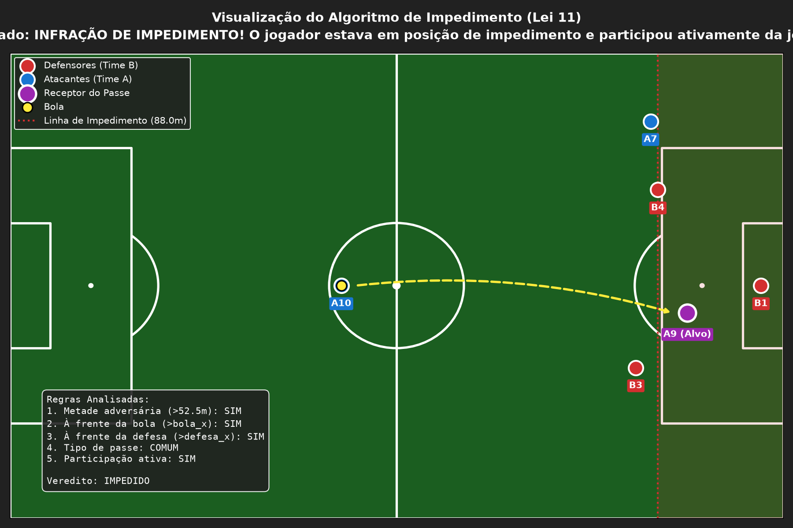

# ⚽ FIFA Law 11 - Algoritmo de Impedimento

Este repositório apresenta uma implementação em **Python** do algoritmo de marcação de impedimento, seguindo rigorosamente as regras oficiais do futebol (Lei 11 da International Football Association Board - IFAB / FIFA).

O projeto inclui a lógica algorítmica de verificação de coordenadas, cenários de teste automatizados e uma renderização gráfica 2D do lance no campo de futebol.

---

## 🧩 O Algoritmo de Impedimento (Lei 11)

Um jogador atacante comete a **infração de impedimento** se, no momento em que a bola é jogada ou tocada por um companheiro de equipe, ele estiver:

1. **Na metade ofensiva do campo** (excluindo a linha de meio de campo).
2. **Mais próximo da linha de meta adversária do que a bola**.
3. **Mais próximo da linha de meta adversária do que o penúltimo defensor** (incluindo o goleiro).
4. **Participando ativamente da jogada** (interferindo no jogo, no adversário ou obtendo vantagem da posição).

### Exceções
Não há infração de impedimento se o atacante receber a bola diretamente de:
* Tiro de meta
* Arremesso lateral
* Escanteio (tiro de canto)

---

## 💻 Estrutura do Código

O projeto é dividido nos seguintes arquivos:

* **`futbol_impedimento.py`**: Contém as classes `Jogador` e `Bola` e a função principal `verificar_impedimento`, além de rodar os 6 cenários clássicos de testes.
* **`visualizar_campo.py`**: Utiliza `matplotlib` para desenhar o campo de futebol e gerar o gráfico do lance simulado.
* **`rodar_testes.bat`**: Script de automação para Windows que configura o ambiente virtual e executa todo o fluxo com um único clique.
* **`requirements.txt`**: Dependências necessárias (ex: `matplotlib`).

---

## 📊 Visualização Gráfica

Abaixo está o gráfico gerado pelo script para o **Cenário 2** (Impedimento Ativo), onde o atacante `A9` recebe um passe de `A10` à frente do penúltimo defensor `B4` (linha vermelha pontilhada):



---

## 🚀 Como Executar

### Windows (Duplo Clique)
1. Certifique-se de que o **Python** está instalado e adicionado ao seu PATH.
2. Dê um duplo clique no arquivo **`rodar_testes.bat`**. O script configurará o ambiente virtual `.venv` automaticamente na primeira execução, instalará as dependências e rodará os testes.

### Manualmente (Qualquer Sistema Operacional)
1. Crie e ative o ambiente virtual:
   ```bash
   python -m venv .venv
   # No Windows:
   .venv\Scripts\activate
   # No Linux/macOS:
   source .venv/bin/activate
   ```
2. Instale as dependências:
   ```bash
   pip install -r requirements.txt
   ```
3. Execute o validador lógico:
   ```bash
   python futbol_impedimento.py
   ```
4. Gere o gráfico do campo:
   ```bash
   python visualizar_campo.py
   ```
